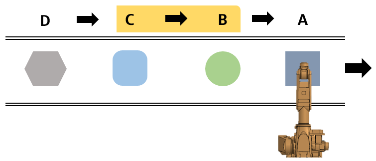

# 1.1 외부선택에 의한 방식

컨베이어를 따라 서로 다른 작업물이 연속하여 진입하는 경우 각 작업물을 외부 프로그램 선택 방법에 의해 프로그램을 선택한 후, 이를 프로그램 예약 실행 레지스터에 등록하여 예약된 프로그램을 순서대로 실행하는 기능입니다. 

위 그림은 A번 프로그램을 실행하는 동안 B번과 C번 프로그램이 프로그램 예약 실행 레지스터에 순서대로 등록된 상태를 나타내며 D번 프로그램은 아직 등록되지 않은 상태를 나타냅니다.