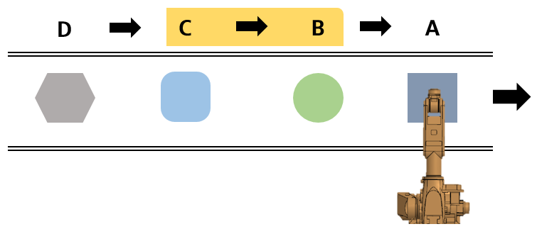

# 1.1 External Selection Method

When different workpieces enter consecutively along a conveyor, you can select the program for each workpiece via an external program selection method and register it in the Program Scheduled Execution Register so the scheduled programs are executed in order.

The figure above shows that while program A is running, programs B and C have been registered in the Program Scheduled Execution Register in order, and program D has not yet been registered.
