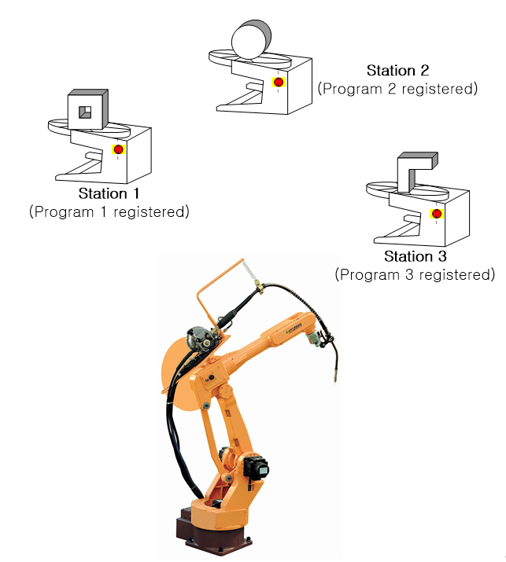

# 1.2 내부설정에 의한 방식

각 작업대상의 작업물에 대해 프로그램된 경우 작업대 위의 버튼이 눌려지면 이 입력에 해당되는 프로그램 번호를 프로그램 예약 실행레지스터에 등록한 후, 이 순서에 따라 프로그램을 실행합니다.

위의 그림과 같이 3개의 작업대에 각각 다른 작업물이 놓인 경우 작업대 1번, 2번, 3번 위의 버튼이 입력될 때 이에 해당하는 1번, 2번, 3번 프로그램이 프로그램 예약 실행 레지스터에 등록됩니다.

조작자는 작업물 1번이 준비되면 작업대 입력버튼을 누른 후, 조작패널의 기동버튼을 누르면 프로그램 1번이 실행되기 시작합니다. 1번 프로그램이 실행되는 동안 작업물 2번을 준비하고 작업대 입력버튼을 누르면 프로그램 2번은 프로그램 예약 레지스터에서 대기합니다. 프로그램 1번의 실행이 완료된 후, 프로그램 예약 레지스터에 대기중이던 프로그램 2번이 실행됩니다. 만일 1번 프로그램이 실행 완료된 상태에서 2번 작업대 입력버튼을 누르면, 기동버튼을 다시 눌러야만 합니다.
