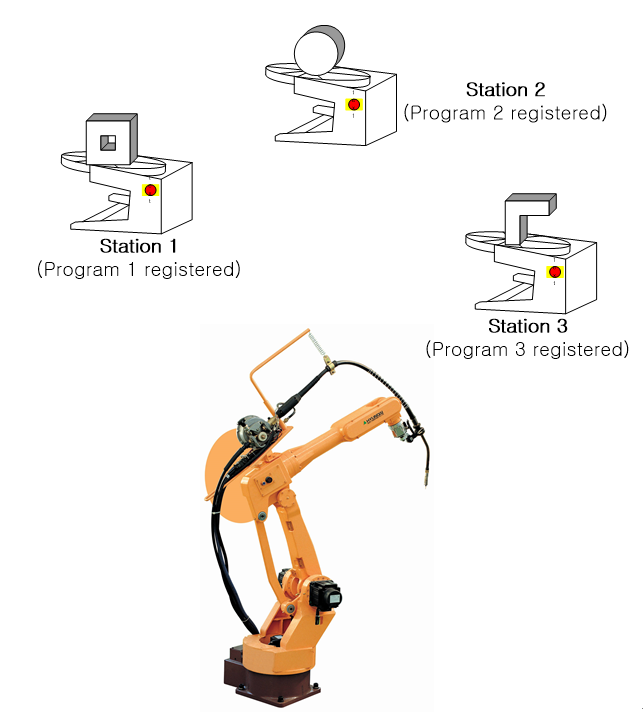

# 1.2 Internal Setting Method

If a program has been assigned for each work target, pressing the button on the workbench registers the corresponding program number in the Program Scheduled Execution Register, and programs are executed in that order when started.

If different workpieces are placed on three workstations as shown above, pressing the buttons on workstations 1, 2, and 3 registers programs 1, 2, and 3 respectively in the Program Scheduled Execution Register.

When the operator prepares workpiece 1 and presses the workstation input button and then the start button on the operation panel, program 1 begins execution. While program 1 is running, if the operator prepares workpiece 2 and presses the workstation input button, program 2 waits in the Program Scheduled Register. After program 1 finishes, program 2 that was waiting in the Program Scheduled Register executes. If the input button for workstation 2 is pressed after program 1 has already completed, the start button must be pressed again.
