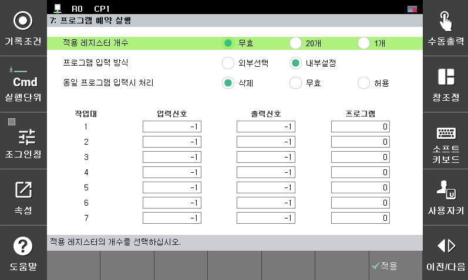
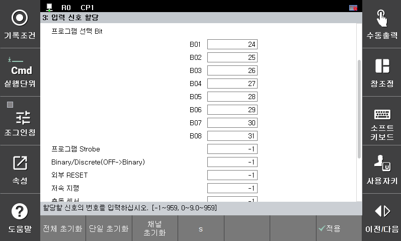

# 2.1 프로그램 예약 실행 환경 설정
프로그램 예약 실행 기능을 위한 환경은 [**시스템 > 제어 파라미터 > 프로그램 예약 실행**]에서 설정합니다.

- 적용 레지스터 개수

    - 무효 
     프로그램 예약 실행 기능을 사용하지 않습니다.

    - 20개
     프로그램 예약 실행 레지스터를 20개 마련합니다. 20개를 초과하여 프로그램을 미리 예약하려면 E1047 에러가 발생합니다.

    - 1개
     프로그램 예약 실행 레지스터를 1개를 마련합니다. 1개의 프로그램만 예약할 수 있습니다. 따라서 서로 다른 작업물이 연속하여 2개 이상 진입하는 공법에서 미리 예약하고자 할 때는 사용할 수 없습니다.  

 

- 프로그램 입력방식

    - 외부선택
     [**시스템 > 제어 파라미터 > 입출력 신호 설정 > 입력 신호 할당**]에서 “프로그램 선택 Bit”로 입력된 프로그램을 프로그램 예약 실행 레지스터에 등록합니다.

        
  
        -	위 그림에서 프로그램 Strobe 입력신호를 할당하십시오.
        -	외부에서 입력되는 프로그램 선택 신호를 Binary 또는 Discrete로 수신할지 선택하는 Binary/Discrete(OFF->Binary) 입력신호도 할당하여 수신방법에 따라 사용하십시오.
        -	수신방법은 프로그램 Strobe 신호가 Low->High로 변경되면 Binary/Discrete(OFF->Binary)에 따라 프로그램 선택 Bit를 읽고 원하는 프로그램 번호를 생성합니다. 프로그램 선택 Bit 입력신호는 반드시 프로그램 Strobe 입력신호보다 200msec 먼저 활성화 시켜야 합니다.
        -	외부선택 모드를 사용할 때는 [**시스템 > 사용자 환경**]에서 “프로그램 스트로브신호 사용”을 “유효”로 설정해야 합니다.

    - 내부설정
     입력 신호와 그에 해당하는 프로그램 번호를 미리 사용자가 지정해 두고 입력신호가 ON 되면 지정한 프로그램 번호를 레지스터에 등록합니다.
        -	총 7개의 서로 다른 작업장치를 제공합니다.
        -	“동일 프로그램 입력시 처리”메뉴는 내부설정일 때만 사용합니다.

 

- 동일 프로그램 입력 시 처리
프로그램 입력방식이 “내부설정”에서 프로그램 예약 실행 레지스터에 프로그램 번호를 예약할 때 이미 레지스터에 동일 프로그램이 존재하는 경우에 예약 결정을 처리하는 기능입니다.

    - 삭제 
     레지스터에 예약된 프로그램 번호를 삭제하는 조건입니다. 레지스터에 예약된 동일한 프로그램 번호를 찾아서 삭제합니다. “예약된 프로그램(No:xxx) 삭제됩니다” 알림이 화면에 표시됩니다.

    - 금지
     레지스터에 이미 동일한 프로그램이 예약되어 있으면 등록하지 않습니다.  “프로그램(No:xxx) 예약이 금지됩니다” 알림이 화면에 표시됩니다.

    - 허용
     레지스터가 비어 있으면 등록합니다.

- 입력신호  
    - I/O보드에 장착된 입력커넥터의 각각의 포트에 대한 신호를 설정합니다.

    - 입력신호 할당에서 외부기동과 외부정지 신호 할당이 안되어 있을 때 작업대 입력버튼을 누르면 외부기동이나 외부정지 명령으로도 사용할 수 있습니다.
        -   외부기동 : 프로그램 번호 예약과 동시에 외부기동을 실행
        -   외부정지 : 현재 실행되는 프로그램을 예약하면 외부정지 실행

 

- 출력신호
    - I/O보드에 장착된 출력커넥터의 각각의 포트에 대한 신호를 설정합니다.
    - 출력신호에 램프가 연결된 경우 프로그램 번호가 레지스터에 예약되어 실행되기까지 램프에 다음의 변화가 발생합니다.
        -	프로그램 번호가 예약되지 않은 경우 	→ 램프소등
        -	프로그램 번호가 예약된 경우		→ 램프점멸
        -	예약된 프로그램 번호가 실행중인 경우 	→ 램프점등
        -	예약된 프로그램 번호가 실행완료 된 경우	→ 램프소등

 

- 프로그램
해당 작업대의 작업 프로그램을 설정합니다.
프로그램 번호가 할당되지 않으면 “예약 프로그램 번호가 할당되지 않았습니다”알림이 화면에 표시됩니다.