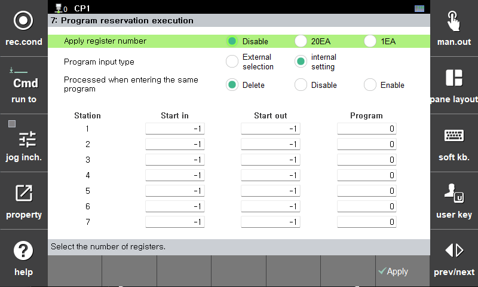
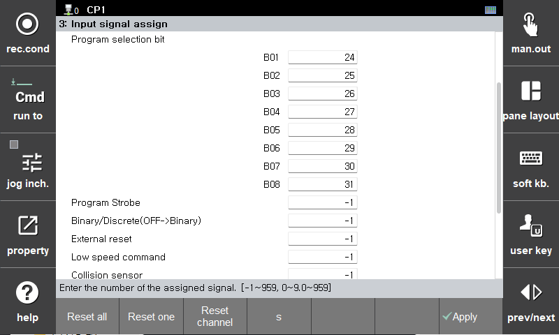

# 2.1 Program Scheduled Execution Preferences
The environment for the Program Scheduled Execution feature is configured under `System > Control Parameters > Program Scheduled Execution`.

## Applied register count  
- Disabled  
The Program Scheduled Execution feature is not used.

- 20  
Prepare 20 registers for the Program Scheduled Execution. If you try to schedule more than 20 programs, an E1047 error will occur.

- 1  
Prepare 1 register for Program Scheduled Execution. Only one program can be scheduled. Therefore, it cannot be used in production lines where more than one different workpiece enters consecutively and pre-scheduling is required.  

  

## Program input method  
- External Selection  
Registers the program assigned as the "Program Select Bit" in `System > Control Parameters > I/O Signal Settings > Input Signal Assignment` into the Program Scheduled Execution Register.

    

    - Assign the program Strobe input signal in the figure above.
    - Assign a Binary/Discrete (OFF->Binary) input signal to select whether to receive externally input program selection signals as Binary or Discrete, and use according to the receiving method.
    - The reception method reads the Program Select Bit when the program Strobe signal changes from Low to High and generates the desired program number according to Binary/Discrete(OFF->Binary). The Program Select Bit input signal must be activated at least 200ms before the program Strobe input signal.
    - When using the External Selection mode, set "Use Program Strobe Signal" to "Enabled" under `System > User Preferences`.

- Internal Setting  
The user preassigns input signals and their corresponding program numbers, and when the input signal turns ON, the specified program number is registered in the register.
    - Provides up to 7 different work devices.
    - The "Handle duplicate program input" menu is only used when in Internal Setting mode.
    - The workstation's input signals can also be used as external start and stop buttons (see the ["Input Signals"](#input-signals) section).
  

## Handling duplicate program inputs  
When the Program input method is set to "Internal Setting" and a program number identical to one already in the Program Scheduled Execution Register is input, this setting determines how to handle the duplicate registration.

- Delete  
Deletes the registered program number in the register. It searches for the identical program number in the register and deletes it. A notice "Reserved program (No:xxx) will be deleted" is displayed on the screen.

- Prohibit  
Does not register if an identical program is already reserved in the register. A notice "Program (No:xxx) reservation is prohibited" is displayed on the screen.

- Allow  
Registers if the register is empty.

## Input signals  
- Configure the signal for each port of the input connectors mounted on the I/O board.

- When external start and external stop signals are not assigned in Input Signal Assignment, pressing the workstation input button can be used as external start or external stop commands.
    -   External start : execute the external start simultaneously with registering a program number.
    -   External stop : executes external stop when scheduling the currently running program.

  

## Output signals  
- Configure the signal for each port of the output connectors mounted on the I/O board.
- When a lamp is connected to the output signal, the lamp changes as follows from the time the program number is scheduled in the register until it is executed.
    - When the program number is not scheduled → Lamp off
    - When the program number is scheduled → Lamp blinking
    - When the scheduled program number is running → Lamp on
    - When the scheduled program number has completed → Lamp off

  

## Program  
Set the operation program for the corresponding workstation.
If a program number is not assigned, a notice "Reserved program number is not assigned" is displayed on the screen.
