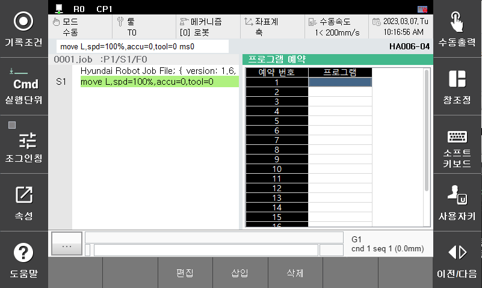

# 2.2. 프로그램 예약 실행 레지스터

프로그램 예약 실행 레지스터는 예약된 프로그램을 확인, 변경, 삽입 또는 삭제할 수 있는 기능입니다. 프로그램 예약 실행 설정에서 적용 레지스터 개수가 '20개' 또는 '1개'인 경우에 사용할 수 있습니다. panel 선택 창에서 [**프로그램 예약**]을 선택합니다.

- 편집
 현재 위치의 예약된 프로그램을 변경할 때는 편집”버튼을 클릭한 후 원하는 프로그램 번호를 입력하면 됩니다.

- 삽입
 “삽입”버튼을 클릭한 후 원하는 예약 프로그램 번호를 입력하면 현재위치 다음에 새로운 프로그램이 예약 됩니다.

- 삭제
 삭제하고자 하는 예약 프로그램 번호에 위치시키고 “삭제”버튼을 클릭하여 해당 프로그램 번호를 레지스터에서 삭제할 수 있습니다.

 

[**참고사항**]
- 원격모드에서는 실행할 수 없습니다.