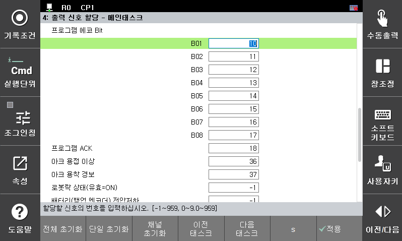

# 2.3 프로그램 예약상태 외부확인

- 외부선택 방식
 외부에서 입력된 예약 프로그램 번호를 “프로그램 ACK”신호와 동기하여 “프로그램 에코 Bit”신호를 외부로 출력합니다. [**시스템 > 제어 파라미터 > 입출력 신호 설정 > 출력 신호 할당**]에서 신호를 할당합니다.
 

    - 선택된 프로그램 번호를 "프로그램 에코 Bit"에 할당된 신호로 출력
    - "프로그램 ACK"에 할당된 신호를 200ms동안 출력

 

- 내부설정 방식
 [**시스템 > 제어 파라미터 > 프로그램 예약 실행**]에서 예약된 프로그램에 할당한 출력 신호에 점멸 신호가 출력됩니다.
    - 출력신호의 확인 방법은 2.1장의 “출력신호”의 설명을 참조바랍니다.
