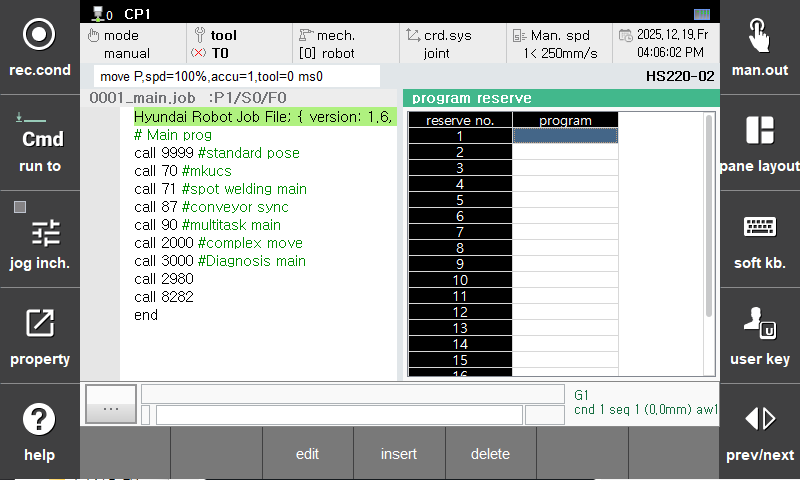

# 2.2 Program Scheduled Execution Register

The Program Scheduled Execution Register allows you to confirm, change, insert, or delete scheduled programs. This can be used when the Applied register count in Program Scheduled Execution settings is set to '20' or '1'. Select `[Program Schedule]` from the panel selection window.

- Edit  
To change the scheduled program at the current position, click the "Edit" button and enter the desired program number.

- Insert  
Click the "Insert" button and enter the desired reserved program number to reserve a new program after the current position.

- Delete  
Position on the reserved program number you want to delete and click the "Delete" button to remove the program number from the register.

  

`[Note]`
- Cannot be executed in Remote Mode.
