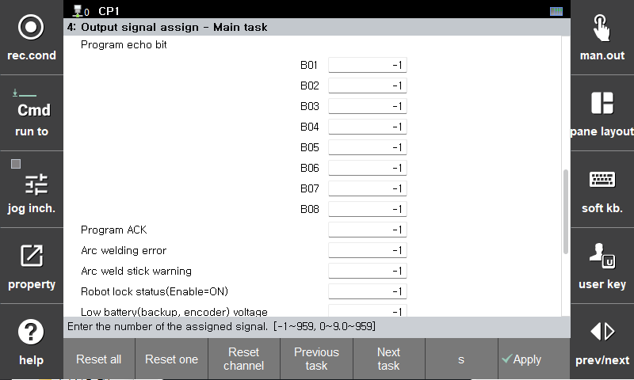

# 2.3 程序调度状态的外部检查

- 外部选择  
输出与外部输入的保留程序号同步的“程序回显位”信号，该信号与“程序确认”信号同步。在 `System > Control Parameters > I/O Signal Settings > Output Signal Assignment` 下分配信号。
 

    - 将选定的程序号输出到分配给“程序回显位”的信号
    - 将分配给“程序确认”的信号输出200毫秒

  

- 内部设置  
在 `System > Control Parameters > Program Scheduled Execution` 中，输出信号分配给保留程序的输出信号闪烁。
    - 有关输出信号的检查方法，请参阅第2.1节中“输出信号”的说明。