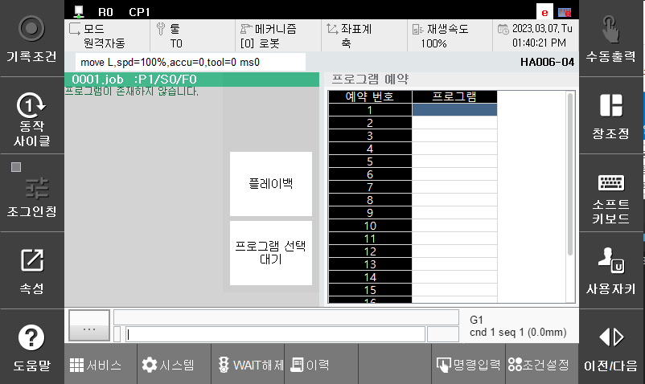

# 3. 재생
- 스텝 0에서 실행
 기동버튼 입력 시 로봇 제어기는 프로그램 예약 실행 레지스터의 첫 번째 프로그램을 실행합니다. 프로그램 END까지 실행한 후 프로그램 예약 실행 레지스터에 등록된 다음 프로그램을 실행합니다.

- 스텝 중간에서 실행
 기동버튼 입력 시 선택된 프로그램의 선택된 명령문부터 실행합니다. 이 프로그램의 실행을 마친 후, 프로그램 예약 실행 레지스터에 등록된 프로그램을 실행합니다.

- 예약된 프로그램이 없을 때 실행
 레지스터에 등록된 프로그램이 존재하지 않는 경우, 기동버튼을 입력하면 다음의 화면과 같이 프로그램 예약 실행 레지스터에 프로그램이 등록되기까지 계속 대기합니다. 여기서 프로그램이 등록되면 그와 동시에 프로그램을 실행합니다.
 