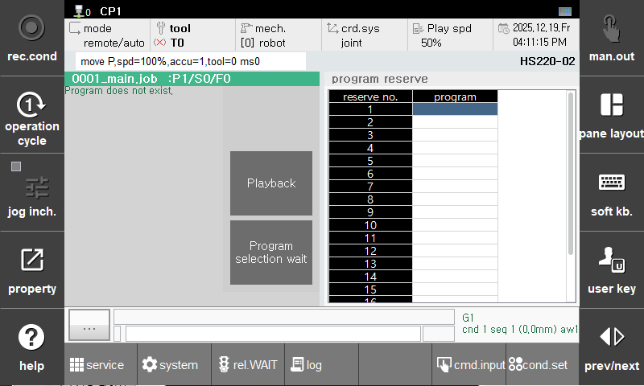

# 3. Playback
- Execute from step 0  
When the start button is pressed, the robot controller executes the first program in the Program Scheduled Execution Register. After executing until the program END, it executes the next program registered in the Program Scheduled Execution Register.

- Execute from a mid step  
When the start button is pressed, execution begins from the selected statement of the selected program. After completing the execution of this program, it executes the programs registered in the Program Scheduled Execution Register.

- Execute when no scheduled program exists  
If no programs are registered in the register, when pressing the start button, it will wait until a program is registered in the Program Scheduled Execution Register as shown in the figure below. When a program is registered, it executes it immediately.

 
